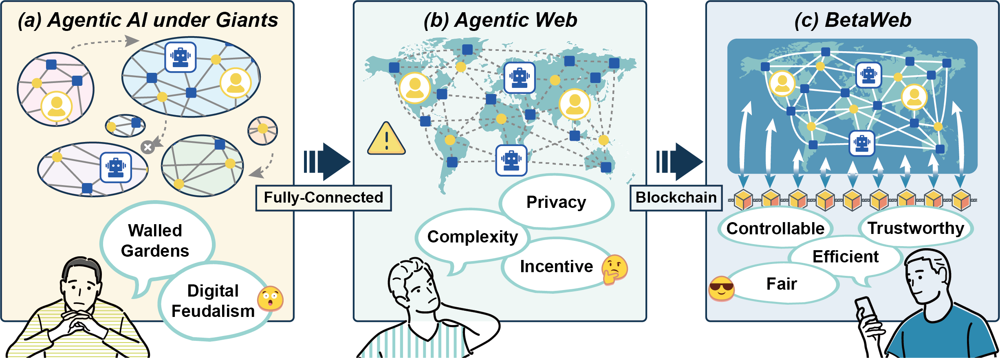
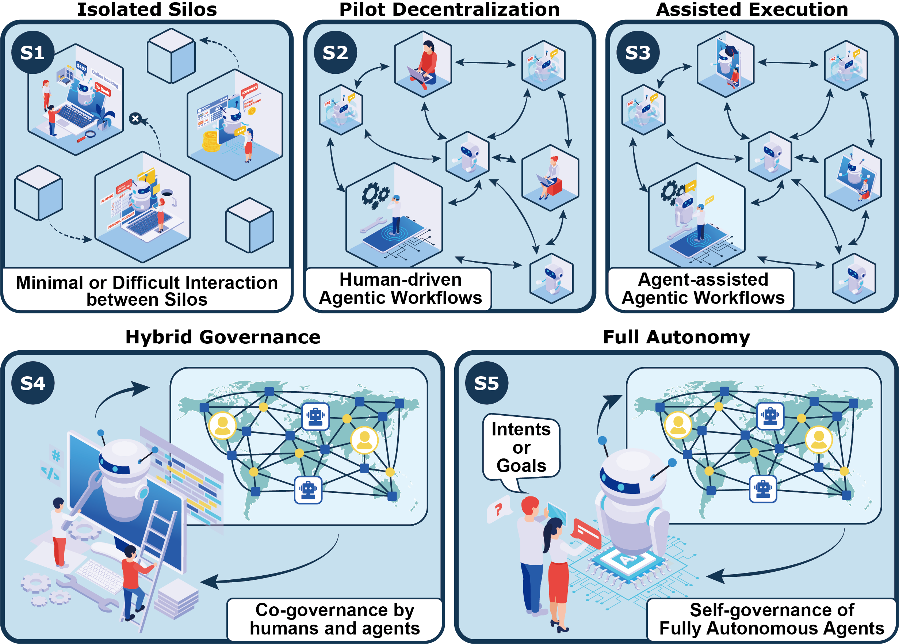

#  BetaWeb: Towards a Blockchain-enabled Trust-worthy Agentic Web

**[Zihan Guo](#)<sup>1,2</sup>   [Yuanjian Zhou](#)<sup>1</sup>   [Chenyi Wang](#)<sup>1,3</sup>   [Linlin You](#)<sup>2</sup>   [Minjie Bian](#)<sup>4</sup>   [Weinan Zhang](#)<sup>1,5\*</sup>**

<sup>**1**</sup>Shanghai Innovation Institute   <sup>**2**</sup>Sun Yat-sen University   <sup>**3**</sup>Zhejiang University   <sup>**4**</sup>Shanghai Data Group Co., Ltd   <sup>**5**</sup>Shanghai Jiao Tong University

\* Corresponding authors.

---

The repository is for paper [**BetaWeb**](https://arxiv.org/abs/2508.13787), which proposes the blockchain-enabled trustworthy Agentic Web (BetaWeb, $\beta$-Web) and explores its evolutionary roadmap. Here, we hope to summarize the key technologies and related research at each stage to support better ecological development.

If your work is featured here and you would prefer it not to be included, feel free to contact us at <wcy0590@gmail.com> or <guozh29@mail2.sysu.edu.cn>. For any questions or feedback, we also welcome you to reach out via the same address. (This repository is under actively development. We appreciate any constructive comments and suggestions)

We also welcome contributions! If you find relevant papers that should be included here, please submit a PR. We'll review all suggestions promptly and update the list accordingly.

**Content**
- [ BetaWeb: Towards a Blockchain-enabled Trust-worthy Agentic Web](#-betaweb-towards-a-blockchain-enabled-trust-worthy-agentic-web)
  - [Intro](#intro)
  - [Isolated Silos](#isolated-silos)
    - [Communication Protocol](#communication-protocol)
    - [Agentic Workflow](#agentic-workflow)
    - [Domain-specific Agents](#domain-specific-agents)
    - [Agentic AI](#agentic-ai)
  - [Pilot Decentralization](#pilot-decentralization)
    - [About Blockchain](#about-blockchain)
    - [About LaMAS](#about-lamas)
  - [Assisted Execution](#assisted-execution)
    - [About Blockchain](#about-blockchain-1)
    - [About LaMAS](#about-lamas-1)
  - [Hybrid Governance](#hybrid-governance)
    - [About Blockchain](#about-blockchain-2)
    - [About LaMAS](#about-lamas-2)
  - [Full Autonomy](#full-autonomy)
    - [About Blockchain](#about-blockchain-3)
    - [About LaMAS](#about-lamas-3)
  - [Citation](#citation)
---

## Intro

<div align="center">
    
</div>
<div align="justify">
<b>Figure 1</b>: Schematic illustration of the evolution from siloed and platform-controlled agentic AI ecosystems to BetaWeb. (a) Current stage dominated by a few major giants, where users and agents are tightly connected within the ``walled garden'' of each platform, with only weak inter-platform links, reflecting digital feudalism concerns. (b) Conceptual open Agentic Web, where users and agents are globally connected, but face challenges such as privacy protection, coordination complexity, and incentive alignment. (c) Vision of BetaWeb, where decentralized infrastructure supports trustworthy, controllable, efficient, and fair interactions among globally connected users and agents.
</div>
</br>

**Table 1**: Overview of the five-stage evolutionary roadmap.

| **Stage** | **Name** | **Explanation** |
|-----------|----------|-----------------|
| Stage 1 (S1) | Isolated Silos | Designed LaMAS under human control with siloed governance |
| Stage 2 (S2) | Pilot Decentralization | Decentralized LaMAS still human-led with limited agentic workflows |
| Stage 3 (S3) | Assisted Execution | Agent-assisted LaMAS freeing human labor |
| Stage 4 (S4) | Hybrid Governance | Co-governed LaMAS relieving human cognitive burdens |
| Stage 5 (S5) | Full Autonomy | Autonomous LaMAS with humans setting only the overarching direction |

<div align="center">
    
</div>
<div align="justify">
<b>Figure 2</b>: Five-stage evolution diagram of BetaWeb. Stage 1 (Isolated Silos) shows independent systems where humans drive all tasks, and agents are confined within their platforms with minimal outward interaction. Stage 2 (Pilot Decentralization) introduces cross-platform collaboration, but agentic workflows are completed under human supervision. Stage 3 (Assisted Execution) involves agents to undertake specialized duties, reducing the workload on humans. Stage 4 (Hybrid Governance) depicts large-scale distributed collaboration, where agents participate in governance while humans focus on high-value decisions. Stage 5 (Full Autonomy) represents a fully autonomous system where agents operate globally with end-to-end self-management without human intervention, requiring only the presentation of intents or goals.
</div>


## Isolated Silos

### Communication Protocol
- [Agent2Agent (A2A) Protocol](https://github.com/a2aproject/A2A) 
- [Model Context Protocol (MCP)](https://github.com/modelcontextprotocol)
- [Agent Network Protocol (ANP)](https://github.com/agent-network-protocol/AgentNetworkProtocol)
- [Agora Protocol](https://agoraprotocol.org/)

### Agentic Workflow
- [HAWK: A Hierarchical Workflow Framework for Multi-Agent Collaboration](https://arxiv.org/html/2507.04067v1) by Yuyang Cheng, Yumiao Xu, Chaojia Yu, Yong Zhao. 2025
- [Aflow: Automating agentic workflow generation](https://arxiv.org/abs/2410.10762) by Jiayi Zhang, Jinyu Xiang, Zhaoyang Yu, Fengwei Teng, Xionghui Chen, Jiaqi Chen et al. 2025
- [MetaGPT: Meta programming for a multi-agent collaborative framework](https://arxiv.org/abs/2308.00352) by Sirui Hong, Mingchen Zhuge, Jiaqi Chen, Xiawu Zheng, Yuheng Cheng, Ceyao Zhang et al. 2024
- [A survey on LLM-based multi-agent systems: workflow, infrastructure, and challenges](https://link.springer.com/article/10.1007/s44336-024-00009-2) by Xinyi Li, Sai Wang, Siqi Zeng, Yu Wu, Yi Yang. 2024 

### Domain-specific Agents
- [SWE-agent: Agent-Computer Interfaces Enable Automated Software Engineering](https://arxiv.org/abs/2405.15793) by John Yang, Carlos E. Jimenez, Alexander Wettig, Kilian Lieret, Shunyu Yao, Karthik Narasimhan, Ofir Press. 2024
- [Prover Agent: An Agent-based Framework for Formal Mathematical Proofs](https://arxiv.org/abs/2506.19923) by Kaito Baba, Chaoran Liu, Shuhei Kurita, Akiyoshi Sannai. 2025
- [Robin: A multi-agent system for automating scientific discovery](https://arxiv.org/abs/2505.13400) by Ali Essam Ghareeb, Benjamin Chang, Ludovico Mitchener, Angela Yiu, Caralyn J. Szostkiewicz, Jon M. Laurent, Muhammed T. Razzak, Andrew D. White, Michaela M. Hinks, Samuel G. Rodriques. 2025
- [ComfyGPT: A Self-Optimizing Multi-Agent System for Comprehensive ComfyUI Workflow Generation](https://arxiv.org/abs/2503.17671) by Oucheng Huang, Yuhang Ma, Zeng Zhao, Mingrui Wu, Jiayi Ji, Rongsheng Zhang, Zhipeng Hu, Xiaoshuai Sun, Rongrong Ji. 2025
- [SurgRAW: Multi-Agent Workflow with Chain-of-Thought Reasoning for Surgical Intelligence](https://arxiv.org/abs/2503.10265) by Chang Han Low, Ziyue Wang, Tianyi Zhang, Zhitao Zeng, Zhu Zhuo, Evangelos B. Mazomenos, Yueming Jin. 2025


### Agentic AI
- [Ai agents vs. agentic ai: A conceptual taxonomy, applications and challenges](https://arxiv.org/abs/2505.10468) by Ranjan Sapkota, Konstantinos I. Roumeliotis, Manoj Karkee. 2025
- [A Survey on Large Language Model based Autonomous Agents](https://arxiv.org/abs/2308.11432) by Lei Wang, Chen Ma, Xueyang Feng, Zeyu Zhang, Hao Yang, Jingsen Zhang, Zhiyuan Chen, Jiakai Tang, Xu Chen, Yankai Lin, Wayne Xin Zhao, Zhewei Wei, Ji-Rong Wen. 2024
- [Single-agent or Multi-agent Systems? Why Not Both?](https://arxiv.org/pdf/2505.18286) by Mingyan Gao, Yanzi Li, Banruo Liu, Yifan Yu, Phillip Wang, Ching-Yu Lin, Fan Lai. 2025
- [Multi-Agent Collaboration Mechanisms: A Survey of LLMs](https://arxiv.org/abs/2501.06322) by Khanh-Tung Tran, Dung Dao, Minh-Duong Nguyen, Quoc-Viet Pham, Barry O'Sullivan, Hoang D. Nguyen. 2025


## Pilot Decentralization
### About Blockchain
- **Decentralized Identifier**
  - [A novel zero-trust identity framework for agentic ai: Decentralized authentication and fine-grained access control](https://arxiv.org/abs/2505.19301) by Ken Huang, Vineeth Sai Narajala, John Yeoh, Jason Ross, Ramesh Raskar, Youssef Harkati. 2025
  - [A Survey on Decentralized Identifiers and Verifiable Credentials](https://arxiv.org/html/2402.02455v1) by Carlo Mazzocca , Abbas Acar , Selcuk Uluagac , Rebecca Montanari , Paolo Bellavista. 2024
- **Platform**
  - [Ethereum](https://ethereum.org/en/)
  - [Solana](https://solana.com/zh/docs/intro/quick-start)
  - [ChainMaker](https://search-docs.chainmaker.org.cn/v/2.3.7)
- **Decentralized Storage**
  - [An innovative IPFS-based storage model for blockchain](https://ieeexplore.ieee.org/abstract/document/8609675/) by Qiuhong Zheng, Yi Li, Ping Chen, Xinghua Dong. 2018
  - [The InterPlanetary File System(IPFS)](https://docs.ipfs.tech/)
  - [The Arweave network](https://arweave.org/build)
- **Light-Client Bridge**
  - [Light Clients for Lazy Blockchains](https://arxiv.org/html/2203.15968v3) by Ertem Nusret Tas, David Tse, Lei Yang, Dionysis Zindros. 2024
- **Cross-Chain Bridge**
  - [The Inter-Blockchain Communication Protocol (IBC)](https://ibc.cosmos.network/v10/?_gl=1*44vf8p*_ga*MTkxNDI4NjM3MS4xNzU1NTczMDA1*_ga_HP8ZXWVLJG*czE3NTU1NzMwMDUkbzEkZzAkdDE3NTU1NzMwMDUkajYwJGwwJGg5ODc5MzI0NDQ.)
  - [LayerZero](https://docs.layerzero.network/v2)
  - [Wormhole](https://wormhole.com/docs/)
- **Lightweight Consensus**
  - [The need for Lightweight Consensus algorithms in IoT environment: A review](https://dl.acm.org/doi/abs/10.1145/3675888.3676072) by Vatsala Upadhyay, Abhishek Vaish, J. Kokila. 2024
  - [An artificial intelligence lightweight blockchain security model for security and privacy in IIoT systems](https://link.springer.com/article/10.1186/s13677-023-00412-y) by Shitharth Selvarajan, Gautam Srivastava, Alaa O. Khadidos, Adil O. Khadidos, Mohamed Baza, Ali Alshehri, Jerry Chun-Wei Lin. 2023 
  - [HotStuff: BFT Consensus in the Lens of Blockchain](https://arxiv.org/abs/1803.05069) by Maofan Yin, Dahlia Malkhi, Michael K. Reiter, Guy Golan Gueta, Ittai Abraham. 2019
- **Zero-Knowledge Proof**
  - [Zero-Knowledge Proof Frameworks: A Systematic Survey](https://arxiv.org/abs/2502.07063) by Nojan Sheybani, Anees Ahmed, Michel Kinsy, Farinaz Koushanfar. 2025


### About LaMAS
- **Blockchain-Based MAS**
  - [Towards Multi-Agent Economies: Enhancing the A2A Protocol with Ledger-Anchored Identities and x402 Micropayments for AI Agents](https://arxiv.org/html/2507.19550v1) by Awid Vaziry, Sandro Rodriguez Garzon, Axel Küpper. 2025
  - [mABC: multi-Agent Blockchain-Inspired Collaboration for root cause analysis in micro-services architecture](https://arxiv.org/abs/2404.12135) by Wei Zhang, Hongcheng Guo, Jian Yang, Zhoujin Tian, Yi Zhang, Chaoran Yan et al. 2024
  - [Blockagents: Towards byzantine-robust llm-based multi-agent coordination via blockchain](https://dl.acm.org/doi/abs/10.1145/3674399.3674445) by Bei Chen, Gaolei Li, Xi Lin, Zheng Wang, Jianhua Li. 2024
- **Task Boundary Definition Language**
  - [Defining Boundaries: A Spectrum of Task Feasibility for Large Language Models](https://arxiv.org/html/2408.05873v1) by Wenbo Zhang, Zihang Xu, Hengrui Cai. 2024


## Assisted Execution
### About Blockchain 
- **Upgradeable Smart Contract**
  - [A Comprehensive Survey of Upgradeable Smart Contract Patterns](https://arxiv.org/pdf/2304.03405) by Sajad Meisami, William Edward Bodell III. 2023
  - [The Universal Upgradeable Proxy Standard (UUPS)](https://github.com/beskay/UUPS_Proxy)
- **Rapid Logic-Patch Pipeline**
  - [Formal Verification of Smart Contracts](https://github.com/runtimeverification/verified-smart-contracts)
- **Hybrid Consensus**
  - [Proof of Stake(PoS) Consensus](https://docs.polkadot.com/polkadot-protocol/architecture/polkadot-chain/pos-consensus/)
  - [SoK: DAG-based Consensus Protocols](https://ieeexplore.ieee.org/abstract/document/10634358/) by Mayank Raikwar, Nikita Polyanskii, Sebastian Müller. 2024
- **Static/Dynamic Security Audit Tools**
  - [Slither, the smart contract static analyzer](https://github.com/crytic/slither)
  - [MythX - Web3 Security Tools](https://docs.mythx.io/)
- **Algorithmic Privacy:**
  - [zero-knowledge Fully Homomorphic Encryption (zk-FHE)](https://zkfhe.github.io/)
  - [MPCLeague: Robust MPC Platform for Privacy-Preserving Machine Learning](https://arxiv.org/abs/2112.13338) by Ajith Suresh. 2021
- **Hardware-Based Privacy:**
  - [A Survey of Secure Computation Using Trusted Execution Environments](https://arxiv.org/abs/2302.12150) by Xiaoguo Li, Bowen Zhao, Guomin Yang, Tao Xiang, Jian Weng, Robert H. Deng. 2023
  - [Intel Software Guard Extensions(SGX)](https://github.com/intel/linux-sgx)

### About LaMAS
- **Agent Capability Certification**
  - [GAIA: a benchmark for General AI Assistants](https://arxiv.org/abs/2311.12983) by Grégoire Mialon, Clémentine Fourrier, Craig Swift, Thomas Wolf, Yann LeCun, Thomas Scialom. 2023
  - [Safearena: Evaluating the safety of autonomous web agents](https://arxiv.org/abs/2503.04957) by Ada Defne Tur, Nicholas Meade, Xing Han Lù, Alejandra Zambrano, Arkil Patel, Esin Durmus et al. 2025
  - [Agent Capability Negotiation and Binding Protocol (ACNBP)](https://arxiv.org/abs/2506.13590) by Ken Huang, Akram Sheriff, Vineeth Sai Narajala, Idan Habler. 2025
- **Agent Capability in Planning**
  - [Agent Planning with World Knowledge Model](https://arxiv.org/abs/2405.14205) by Shuofei Qiao, Runnan Fang, Ningyu Zhang, Yuqi Zhu, Xiang Chen, Shumin Deng, Yong Jiang, Pengjun Xie, Fei Huang, Huajun Chen. 2025
  - [Agent-Oriented Planning in Multi-Agent Systems](https://arxiv.org/abs/2410.02189) by Ao Li, Yuexiang Xie, Songze Li, Fugee Tsung, Bolin Ding, Yaliang Li. 2025
  - [AgentGen: Enhancing Planning Abilities for Large Language Model based Agent via Environment and Task Generation](https://arxiv.org/abs/2408.00764) by Mengkang Hu, Pu Zhao, Can Xu, Qingfeng Sun, Jianguang Lou, Qingwei Lin, Ping Luo, Saravan Rajmohan. 2025
- **Agent Capability in Reasoning**
  - [Agentic Reasoning: A Streamlined Framework for Enhancing LLM Reasoning with Agentic Tools](https://arxiv.org/abs/2502.04644) by Junde Wu, Jiayuan Zhu, Yuyuan Liu, Min Xu, Yueming Jin. 2025
  - [From LLM Reasoning to Autonomous AI Agents: A Comprehensive Review](https://arxiv.org/abs/2504.19678) by Mohamed Amine Ferrag, Norbert Tihanyi, Merouane Debbah. 2025
  - [ReaGAN: Node-as-Agent-Reasoning Graph Agentic Network](https://arxiv.org/abs/2508.00429) by Minghao Guo, Xi Zhu, Jingyuan Huang, Kai Mei, Yongfeng Zhang. 2025
  - [Seeing, Listening, Remembering, and Reasoning: A Multimodal Agent with Long-Term Memory](https://www.arxiv.org/abs/2508.09736) by Lin Long, Yichen He, Wentao Ye, Yiyuan Pan, Yuan Lin, Hang Li, Junbo Zhao, Wei Li. 2025
- **Agent Capability in Tool-Using**
  - [The Landscape of Emerging AI Agent Architectures for Reasoning, Planning, and Tool Calling: A Survey](https://arxiv.org/abs/2404.11584) by Tula Masterman, Sandi Besen, Mason Sawtell, Alex Chao. 2024
  - [LLM Agents Making Agent Tools](https://arxiv.org/abs/2502.11705) by Georg Wölflein, Dyke Ferber, Daniel Truhn, Ognjen Arandjelović, Jakob Nikolas Kather. 2025
- **Management Prtocol for Agents**
  - [AI-Governed Agent Architecture for Web-Trustworthy Tokenization of Alternative Assets](https://arxiv.org/html/2507.00096v1) by Ailiya Borjigin, Wei Zhou, Cong He. 2025
- **Marketplace Mechanism**
  - [Web3 Meets Behavioral Economics: An Example of Profitable Crypto Lottery Mechanism Design](https://arxiv.org/pdf/2206.03664) by Kentaroh Toyoda. 2023
  - [Agent Exchange: Shaping the Future of AI Agent Economics](https://arxiv.org/html/2507.03904v1) by Yingxuan Yang, Ying Wen, Jun Wang, Weinan Zhang. 2025
  - [Dynamic Pricing](https://docs.oracle.com/cd/G26828_02/books/PriceAdm/c-Dynamic-Pricing-Procedure-Workflow-td1021851.html)


## Hybrid Governance
### About Blockchain 
- **LLM-Generated Contract**
  - [On LLM-Assisted Generation of Smart Contracts from Business Processes](https://arxiv.org/html/2507.23087) by Fabian Stiehle, Hans Weytjens, Ingo Weber. 2025
  - [Guiding LLM-based Smart Contract Generation with Finite State Machine](https://arxiv.org/abs/2505.08542) by Hao Luo, Yuhao Lin, Xiao Yan, Xintong Hu, Yuxiang Wang, Qiming Zeng, Hao Wang, Jiawei Jiang. 2025
- **On-chain Knowledge Pool**
  - [Large Language Model Federated Learning with Blockchain and Unlearning for Cross-Organizational Collaboration](https://arxiv.org/abs/2412.13551) by Xuhan Zuo, Minghao Wang, Tianqing Zhu, Shui Yu, Wanlei Zhou. 2024
  - [AIArena: A Blockchain-Based Decentralized AI Training Platform](https://dl.acm.org/doi/abs/10.1145/3701716.3715484) by Zhipeng Wang, Rui Sun, Elizabeth Lui, Tuo Zhou, Yizhe Wen, Jiahao Sun. 2025
  - [Constructing Effective Customer Feedback Systems -- A Design Science Study Leveraging Blockchain Technology](https://arxiv.org/abs/2203.15254) by Mark C. Ballandies, Valentin Holzwarth, Barry Sunderland, Evangelos Pournaras, Jan vom Brocke. 2023
- **Validation Rule**
  - [Vulnerability anti-patterns in Solidity: Increasing smart contracts security by reducing false alarms](https://arxiv.org/html/2410.17204v1) by Tommaso Oss, Carlos E. Budde. 2024
  - [Transaction Proximity: A Graph-Based Approach to Blockchain Fraud Prevention](https://arxiv.org/html/2505.24284v1) by Gordon Liao, Ziming Zeng, Mira Belenkiy, Jacob Hirshman. 2025
- **Human Veto**
  - [Enhancing Responsible AGI Development: Integrating Human-in-the-loop Approaches with Blockchain-based Smart Contracts](http://catalog.journals4promo.com/id/eprint/1617/) by Mahesh Vaijainthymala Krishnamoorthy. 2025
  - [Human-AI Collaboration in Workflow Optimization: A Framework for Hybrid Decision Systems in Automation-Heavy Industries](https://d1wqtxts1xzle7.cloudfront.net/121624930/CSEIT251112384-libre.pdf?1740974417=&response-content-disposition=inline%3B+filename%3DHuman_AI_Collaboration_in_Workflow_Optim.pdf&Expires=1755660713&Signature=Y1AS5CtDvstj-31K94sd0FTM3ZlmfBPoIVm1dD0pGkHODef7OSoLjMB2y11dI3bvn-JvQS~5Rmp0IBU40pBVJ1CSCiL5YcPZ6TIwfqJvEeZ~inpedIGMjNj-2jYZknOA9eXAXUCnfqzqsG0hPUcWd8aPWeifsh7xdStvgjiPzUD4Jq4eVCd0zIALHRUzYgY6NMID8AYQBL2ED7kqwGsWMqYMghTIoRIaO0dWOD0P09a8lXoj7yv6CnLekGOumEI8MBFpnV5JuYKxNSRd9IK2i8ZnwALcspTUoufXMcRuzxklTleHMGXIhzCsxXJ2o7iHHizuD1uQP3RqQEFv~105OQ__&Key-Pair-Id=APKAJLOHF5GGSLRBV4ZA) by Rajarshi Tarafdar. 2025 
  - [A Multi-Dimensional Ontology](hthttps://d1wqtxts1xzle7.cloudfront.net/123848890/TEO-libre.pdf?1752890512=&response-content-disposition=inline%3B+filename%3DA_Multi_Dimensional_Ontology.pdf&Expires=1755661000&Signature=fnWsfbqep1bQBIYXV8rFJn1sY2G8i8Ot6WdjrlQecXlB5negT-rO-YetUiYCqxSkdoO1C~5iuW8liKFq~Ikp~CmJM2Y4Fcqn27Xmqophk3oNvak2s80zSTPOsWF9Y~miaRZ8Ig66fFVObTQFZ6wphw2KZhC0xOkQSyQP8Rjlu2JAxuW2BMcC-bLxsczidN1nfTl5fr9YEhEr~rEmaiCzPswEzEBCrCCIGun4LGaeGWfUmS5UakOh7eI0tTAGkhM9dYxOnj5XuFo93IxYRBy1wLllZhppwgKZT4bKyqxiQieAZMXiU~bX3MZdyBGVEyedRHC0GvRC8tS-ASlPhqBLtg__&Key-Pair-Id=APKAJLOHF5GGSLRBV4ZA) by Flávio J. Ávila. 2025

### About LaMAS
- **Judging Agent**
  - [Gödel Agent: A Self-Referential Agent Framework for Recursive Self-Improvement](https://arxiv.org/abs/2410.04444) by Xunjian Yin, Xinyi Wang, Liangming Pan, Li Lin, Xiaojun Wan, William Yang Wang. 2025
  - [Agent-as-a-Judge: Evaluate Agents with Agents](https://arxiv.org/abs/2410.10934) by Mingchen Zhuge, Changsheng Zhao, Dylan Ashley, Wenyi Wang, Dmitrii Khizbullin, Yunyang Xiong, Zechun Liu, Ernie Chang, Raghuraman Krishnamoorthi, Yuandong Tian, Yangyang Shi, Vikas Chandra, Jürgen Schmidhuber. 2024
- **Self-Evolution**
  - [A Survey of Self-Evolving Agents: On Path to Artificial Super Intelligence](https://arxiv.org/abs/2507.21046) by Huan-ang Gao, Jiayi Geng, Wenyue Hua, Mengkang Hu, Xinzhe Juan, Hongzhang Liu, Shilong Liu, Jiahao Qiu, Xuan Qi, Yiran Wu, Hongru Wang, Han Xiao, Yuhang Zhou, Shaokun Zhang, Jiayi Zhang, Jinyu Xiang, Yixiong Fang, Qiwen Zhao, Dongrui Liu, Qihan Ren, Cheng Qian, Zhenhailong Wang, Minda Hu, Huazheng Wang, Qingyun Wu, Heng Ji, Mengdi Wang. 2025
  - [RAGEN: Understanding Self-Evolution in LLM Agents via Multi-Turn Reinforcement Learning](https://arxiv.org/abs/2504.20073) by Zihan Wang, Kangrui Wang, Qineng Wang, Pingyue Zhang, Linjie Li, Zhengyuan Yang, Xing Jin, Kefan Yu, Minh Nhat Nguyen, Licheng Liu, Eli Gottlieb, Yiping Lu, Kyunghyun Cho, Jiajun Wu, Li Fei-Fei, Lijuan Wang, Yejin Choi, Manling Li. 2025
  - [SE-Agent: Self-Evolution Trajectory Optimization in Multi-Step Reasoning with LLM-Based Agents](https://arxiv.org/abs/2508.02085) by Jiaye Lin, Yifu Guo, Yuzhen Han, Sen Hu, Ziyi Ni, Licheng Wang, Mingguang Chen, Daxin Jiang, Binxing Jiao, Chen Hu, Huacan Wang. 2025
- **Human-Agent Co-Governance**
  - [Bridging AI & Human Cognition for Public Interest: A Human-Centric Co-Governance Framework for Auditing Fairness and Preserving Trust in Digital Ecosystems](https://papers.ssrn.com/sol3/papers.cfm?abstract_id=5048379) by Meriem Mehri. 2024


## Full Autonomy
### About Blockchain 
- **Runtime Verification Framework**
  - [Runtime Verification for Business Processes Utilizing the Bitcoin Blockchain](https://arxiv.org/abs/1706.04404) by Christoph Prybila, Stefan Schulte, Christoph Hochreiner, Ingo Weber. 2017
  - [Runtime Verification Tools](https://github.com/runtimeverification)
- **Scalable and Efficient on-chain Governance Framework**
  - [DAOs of Collective Intelligence? Unraveling the Complexity of Blockchain Governance in Decentralized Autonomous Organizations](https://arxiv.org/abs/2409.01823) by Mark C. Ballandies, Dino Carpentras, Evangelos Pournaras. 2025
  - [Demystifying the DAO Governance Process](https://arxiv.org/abs/2403.11758) by Junjie Ma, Muhui Jiang, Jinan Jiang, Xiapu Luo, Yufeng Hu, Yajin Zhou, Qi Wang, Fengwei Zhang. 2024
  - [Blockchain and the emergence of Decentralized Autonomous Organizations (DAOs): An integrative model and research agenda](https://www.sciencedirect.com/science/article/pii/S0040162522003304) by Carlos Santana, Laura Albareda. 2022
- **On-Chain Self-Upgrade Protocol**
  - [A Four-Tier Smart Contract Model with On-Chain Upgrade](https://www.researchgate.net/publication/367556064_A_Four-Tier_Smart_Contract_Model_with_On-Chain_Upgrade) by Zhiqiang Du, Hao Cheng, Yanfang Fu, Muhong Huang. 2023
  - [Blockchain self-update smart contract for supply chain traceability with data validation](https://academic.oup.com/jigpal/advance-article/doi/10.1093/jigpal/jzae047/7670719) by Cristian Valencia-Payan , David Griol , Juan Carlos Corrales. 2024


### About LaMAS
- **Value-Constraint Learning**
  - [Resolving Conflicting Constraints in Multi-Agent Reinforcement Learning with Layered Safety](https://arxiv.org/abs/2505.02293) by Jason J. Choi, Jasmine Jerry Aloor, Jingqi Li, Maria G. Mendoza, Hamsa Balakrishnan, Claire J. Tomlin. 2025
  - [ReCoDe: Reinforcement Learning-based Dynamic Constraint Design for Multi-Agent Coordination](https://arxiv.org/html/2507.19151) by Michael Amir, Guang Yang, Zhan Gao, Keisuke Okumura, Heedo Woo, Amanda Prorok. 2025
  - [Constraining an Unconstrained Multi-agent Policy with offline data](https://www.sciencedirect.com/science/article/abs/pii/S0893608025001327) by Cong Guan, Tao Jiang, Yi-Chen Li, Zongzhang Zhang, Lei Yuan, Yang Yu. 2025
- **Value-Drift Monitor**
  - [Better Estimation of the KL Divergence Between Language Models](https://arxiv.org/pdf/2504.10637) by Afra Amini, Tim Vieira, Ryan Cotterell. 2025
  - [Correcting the Mythos of KL-Regularization: Direct Alignment without Overoptimization via χ2-Preference Optimization](https://arxiv.org/pdf/2407.13399) by Audrey Huang, Wenhao Zhan, Tengyang Xie, Jason D. Lee, Wen Sun, Akshay Krishnamurthy, Dylan J. Foster. 2025
- **Decentralized Kill Switch**
  - [The Feasibility of a Smart Contract “Kill Switch”](https://arxiv.org/pdf/2407.10302) by Oshani Seneviratne. 2024
- **Agent Social Behavior Simulator**
  - [OASIS: Open Agent Social Interaction Simulations with One Million Agents](https://arxiv.org/abs/2411.11581) by Ziyi Yang, Zaibin Zhang, Zirui Zheng, Yuxian Jiang, Ziyue Gan, Zhiyu Wang, Zijian Ling, Jinsong Chen, Martz Ma, Bowen Dong, Prateek Gupta, Shuyue Hu, Zhenfei Yin, Guohao Li, Xu Jia, Lijun Wang, Bernard Ghanem, Huchuan Lu, Chaochao Lu, Wanli Ouyang, Yu Qiao, Philip Torr, Jing Shao. 2025
  - [AgentSociety: Large-Scale Simulation of LLM-Driven Generative Agents Advances Understanding of Human Behaviors and Society](https://arxiv.org/abs/2502.08691) by Jinghua Piao, Yuwei Yan, Jun Zhang, Nian Li, Junbo Yan, Xiaochong Lan, Zhihong Lu, Zhiheng Zheng, Jing Yi Wang, Di Zhou, Chen Gao, Fengli Xu, Fang Zhang, Ke Rong, Jun Su, Yong Li. 2025


## Citation
If you find the repository useful, please cite the study
``` Bash
@article{guo2025betaweb,
      title={BetaWeb: Towards a Blockchain-enabled Trustworthy Agentic Web}, 
      author={Zihan Guo and Yuanjian Zhou and Chenyi Wang and Linlin You and Minjie Bian and Weinan Zhang},
      year={2025},
      journal={arXiv preprint arXiv:2508.13787},
}
```
